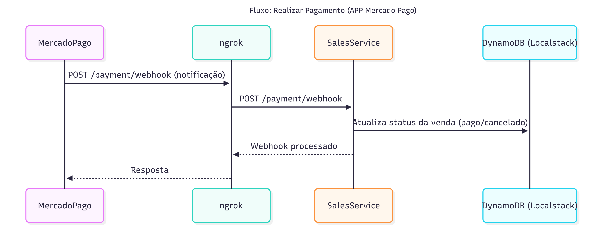

[](https://sonarcloud.io/summary/new_code?id=leandradz_vehicle-sales-service)

# Gerenciador de Vendas de Veículos

[Vídeo de Apresentação]()

## Descrição do Projeto

Uma empresa de revenda de veículos automotores nos contratou pois quer implantar uma
plataforma que funcione na internet, sendo assim, temos que criar a plataforma. O time de UX já está criando os designs, e ficou sob sua responsabilidade criar a API, para que posteriormente o time de frontend integre a solução. O desenho da solução envolve as seguintes necessidades do negócio.

## Estrutura do Projeto

-   **Backend**: Microsserviço utilizando arquitetura hexagonal.
-   **APIs Implementadas**:
    • Efetuar a venda de um veículo (CPF da pessoa que comprou e data da venda).
    • Disponibilizar um endpoint (webhook) para que a entidade que processa o pagamento
    consiga, a partir do código do pagamento, informar se o pagamento foi efetuado ou
    cancelado.
-   **Banco de Dados**: DynamoDB (simulado localmente com LocalStack).

## Como Rodar o Projeto Localmente

Para rodar testar a aplicação completa, você precisará clonar e iniciar também o repositório vehicle-orchestration, além do vehicle-manager-service. Siga os passos:

1. Clone ambos os repositórios:

```bash
git clone https://github.com/leandradz/vehicle-orchestration.git
git clone https://github.com/leandradz/vehicle-manager-service.git
git clone https://github.com/leandradz/vehicle-sales-service.git
```

2. Inicie o vehicle-orchestration:

```bash
cd vehicle-orchestration
docker-compose up -d ngrok
bash set-ngrok-webhook.sh
```

3. Acesse as aplicações:

-   vehicle-manager-service: http://localhost:3002
-   vehicle-sales-service: http://localhost:3001

## Observações

-   Sempre execute o script `set-ngrok-webhook.sh` após subir o ngrok para garantir que o endpoint do webhook esteja atualizado.
-   Para reiniciar todos os serviços com o novo endpoint, basta rodar novamente o script.

## Documentação

-   Acesse a documentação das APIs via Swagger:
    -   [Vehicle Manager](http://localhost:3002/api-docs)
    -   [Vehicle Sales](http://localhost:3001/api-docs)

## Diagrama dos fluxos presentes no Sales Service




